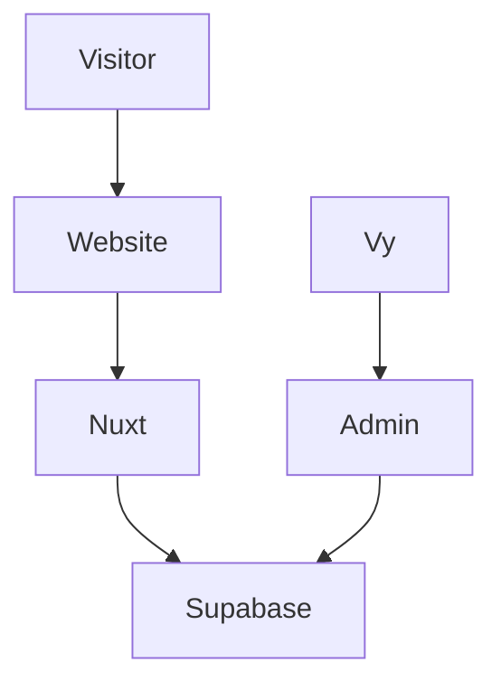
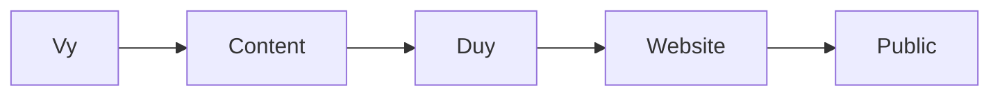
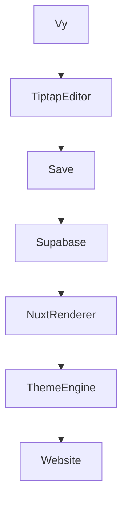
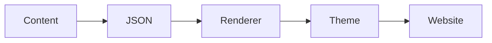

# Personal Blog Project Plan

## Overview

Mục tiêu của dự án là xây dựng một website cá nhân phục vụ cho:

* Chia sẻ trải nghiệm cuộc sống hàng ngày
* Ghi lại hành trình học tập và phát triển bản thân
* Chia sẻ du lịch, công việc và những câu chuyện đáng nhớ
* Xây dựng hình ảnh cá nhân chuyên nghiệp
* Sử dụng như một Portfolio Online khi cần giới thiệu với đối tác hoặc khách hàng

Website được thiết kế theo phong cách:

* Pastel
* Nhẹ nhàng
* Thân thiện
* Dễ đọc
* Tập trung vào nội dung

---

# Vai trò

## Vy

Phụ trách:

* Cung cấp nội dung
* Định hướng hình ảnh cá nhân
* Cung cấp hình ảnh bài viết
* Kiểm tra và góp ý giao diện
* Quản lý nội dung sau khi CMS hoàn thành

---

## Duy

Phụ trách:

* Thiết kế kiến trúc hệ thống
* Thiết kế giao diện
* Phát triển website
* Triển khai hệ thống
* Thiết lập CMS
* Hướng dẫn sử dụng Admin

---

# Công nghệ sử dụng

## Frontend

* Nuxt 4
* TypeScript
* Tailwind CSS

## Backend

* Supabase

### Sử dụng cho

* Authentication
* Database
* Image Storage

## Editor

* Tiptap Editor

## Hosting

* Vercel

## Source Code

* GitHub

---

# Kiến trúc tổng thể



---

# Kế hoạch triển khai trong 1 tháng

## Tuần 1

### Mục tiêu

Hoàn thành giao diện nền tảng.

### Chức năng

* Home Page
* About Me Page
* Contact Page
* Header
* Footer
* Responsive Mobile

### About Me

Được thiết kế theo dạng Portfolio.

Có thể sử dụng khi:

* Giới thiệu bản thân
* Gửi đối tác
* Chia sẻ với khách hàng
* Hồ sơ cá nhân trực tuyến

### Kết quả

Website có thể truy cập online.

---

## Tuần 2

### Mục tiêu

Hoàn thành Blog Public.

### Chức năng

* Blog List
* Blog Detail
* Category
* Tag
* Search cơ bản

### Quy trình nội dung

Trong giai đoạn này:



Vy cung cấp:

* Nội dung
* Hình ảnh
* Ý tưởng bài viết

Duy sẽ chuyển thành nội dung hiển thị trên website.

### Kết quả

Website có thể đăng bài và đọc bài hoàn chỉnh.

---

## Tuần 3

### Mục tiêu

Xây dựng Admin CMS.

### Chức năng

* Login
* Dashboard
* Danh sách bài viết
* Tạo bài viết
* Chỉnh sửa bài viết
* Upload ảnh
* Quản lý Category
* Quản lý Tag

### Kết quả

Vy có thể tự quản lý nội dung.

---

## Tuần 4

### Mục tiêu

Hoàn thiện Editor và Theme Manager.

### Chức năng

* Tiptap Editor
* Draft
* Publish
* Theme Manager
* Kiểm thử tổng thể

---

# Cách hoạt động của Tiptap

Vy sẽ nhìn thấy giao diện tương tự:

* Microsoft Word
* Google Docs

Không cần biết:

* HTML
* CSS
* Markdown

---

# Quy trình tạo bài viết



---

# Dữ liệu được lưu như thế nào

Khi viết bài:

```text
Tiêu đề bài viết

Đây là nội dung bài viết.

Chèn ảnh

Chèn danh sách
```

Tiptap sẽ lưu thành dữ liệu cấu trúc (JSON).

Ví dụ:

```json
{
  "type": "heading"
}
```

và nhiều block nội dung khác.

Điều này giúp nội dung và giao diện được tách riêng.

---

# Lợi ích của cách lưu này

Nội dung:

* Không phụ thuộc giao diện
* Không phụ thuộc theme

Có thể thay đổi giao diện toàn bộ website mà không cần sửa lại bài viết.

---

# Quy trình hiển thị bài viết



---

# Ví dụ

Cùng một bài viết.

## Theme Pastel

* Màu nhẹ
* Khoảng trắng lớn
* Trải nghiệm đọc thoải mái

## Theme Portfolio

* Chuyên nghiệp hơn
* Card nổi bật hơn
* Phù hợp giới thiệu đối tác

Nội dung không thay đổi.

Chỉ thay đổi cách hiển thị.

---

# Định hướng mở rộng sau tháng đầu tiên

Khi số lượng bài viết và hình ảnh tăng lên.

Hoặc khi lượng người truy cập tăng.

Có thể mở rộng:

* Search nâng cao
* Analytics
* Cache
* CDN
* AI hỗ trợ biên tập
* AI hỗ trợ tạo tiêu đề
* AI hỗ trợ tóm tắt bài viết

Mà không cần thay đổi kiến trúc hiện tại.

---

# Chi phí thực tế

## Claude Code

Giai đoạn phát triển:

* Claude Code Max

Dự kiến:

* 1 tháng

Chi phí:

100 USD

---

## Domain

Dự kiến:

10 ~ 20 USD / năm

---

## Vercel

Giai đoạn đầu:

Free

---

## Supabase

Giai đoạn đầu:

Free

---

# Tổng chi phí tháng đầu

| Hạng mục      | Chi phí           |
| --------------- | ------------------ |
| Claude Code Max | 100 USD            |
| Domain          | 10 ~ 20 USD / năm |
| Vercel          | Free               |
| Supabase        | Free               |

---

# Mục tiêu sau 1 tháng

Website hoàn chỉnh bao gồm:

* Home
* About Me
* Contact
* Blog
* Blog Detail
* Admin CMS
* Tiptap Editor
* Theme Manager

Vy có thể tự tạo bài viết mới, chỉnh sửa bài viết và quản lý nội dung mà không cần can thiệp kỹ thuật.
