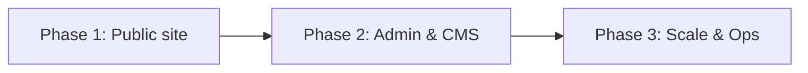
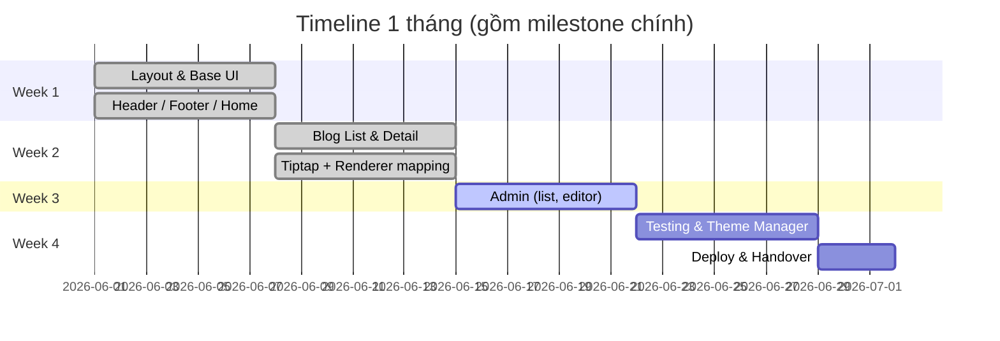
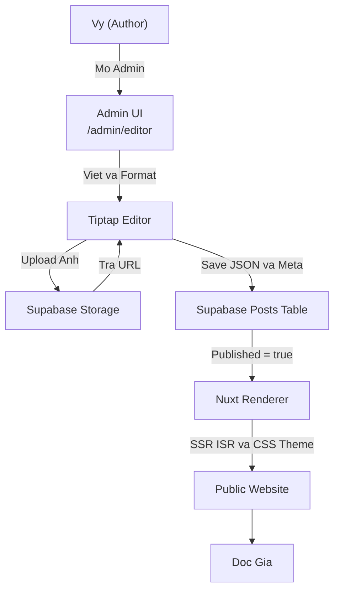

# Proposal gửi Vy — Dự án Blog cá nhân

---

**Tóm tắt vai trò**

- **Vy :** cung cấp nội dung (tiêu đề, body, ảnh), feedback thiết kế, quyết định publish, kiểm tra nội dung trước khi public.
- **Duy:** xây dựng giao diện, kết nối Supabase, triển khai Admin (Tiptap), thực hiện render content trên web, deploy lên Vercel, thiết lập backup & monitoring.

---

**Mục tiêu ngắn hạn:** hoàn thành giao diện public (portfolio + blog), Vy có thể gửi nội dung cho tôi để tôi chuyển lên web.

**Mục tiêu tiếp theo (phase 2):** Vy có thể tự quản lý - thêm/sửa bài qua Admin (Tiptap) và đổi theme cơ bản.

**Mục tiêu mở rộng (phase 3):** xây dựng roadmap nâng cấp khi bài và traffic tăng cao.

---

**Phân thành 3 Phase (thời gian & chi phí)**

Ghi chú quan trọng về chi phí: tháng đầu sẽ là chi phí lớn nhất nhưng chỉ nằm trong phạm vi "Claude Code" (subscription/development tool) và chi phí hosting/setup (domain). Chi phí duy trì sau khi chạy ổn định được tối ưu để nằm dưới $10/tháng (không tính Claude Code). Nếu hệ thống mở rộng vượt các ngưỡng, ta sẽ nhóm các chi phí cần thiết và thông báo Vy trước khi nâng cấp.

Phase 1 — Public site (Layout, Home, About, Contact, Blog list & detail)

- Thời gian dự kiến: 2–3 tuần
- Trách nhiệm: Vy cung cấp nội dung & ảnh; tôi code layout, responsive, blog list & blog detail.
- Deliverables: `Home`, `About (portfolio)`, `Contact`, `Blog List`, `Blog Detail`.
- Chi phí (ước tính tháng 1):
  - Claude Code (development subscription / code assist): $100 (one-time) , Duy chị phí
  - Domain (tùy mua): ~$10–20/year (khấu trừ vào tháng 1 nếu mua ngay).
  - Hosting & CDN (Vercel): **sử dụng Free tier** ban đầu → $0.
  - Supabase: **Free tier** ban đầu → $0.
  - Tổng (tháng 1): ~ $100–120 (phần lớn là Claude Code). Đây là "tháng đầu" có chi phí lớn nhất theo yêu cầu.

Phase 2 — Admin & CMS (Tiptap editor, Media upload, Theme manager)

- Thời gian dự kiến: 1.5–2 tuần
- Trách nhiệm: tôi implement Admin + Tiptap; Vy sẽ thử nghiệm viết bài và duyệt bài trước khi publish.
- Deliverables: `/admin` (login), `/admin/posts` (list), `/admin/editor` (Tiptap), theme switcher cơ bản.
- Chi phí ước tính (chi phí dev đã bao gồm trong Claude Code):
  - Phần hosting/database vẫn dùng Free tier (Supabase + Vercel) -> $0
  - Nếu cần thêm storage/egress lớn (trigger bên dưới) sẽ báo Vy.

Phase 3 — Scale & Ops (khi số bài/ảnh lớn hoặc traffic nhiều)

- Thời gian dự kiến: tbd (phân tích trước khi nâng cấp)
- Trigger & chi phí (khi vượt ngưỡng sẽ cần nâng gói):
  - Supabase Storage > 10 GB hoặc egress > 100 GB/month → cân nhắc nâng gói Supabase (Pro): $25–100+/month.
  - Pageviews > 10k–50k/month hoặc egress > 200–500 GB → cần Image CDN / Vercel Pro / tăng quota: ~$20–$300+/month.
  - Lưu ý: mọi lần nâng gói sẽ báo Vy & đưa ra phương án tiết kiệm (image transforms, cache, CDN, offload media).

**Timeline / milestones (gợi ý)**

---

**Chi phí duy trì mục tiêu:**

- Mục tiêu ban đầu: **< $10 / tháng** cho hosting & DB (bỏ qua Claude Code). Đạt được bằng cách:
  - Dùng Vercel Free + Supabase Free
  - Sử dụng lazy-loading, webp/resized images, cache-control để giảm egress
  - Nếu cần thêm một dịch vụ trả phí nhẹ (ví dụ image optimizer) cố gắng chọn gói <$10/mo

**Khi nào chi phí vượt $10/mo:**

- Nếu lượng egress ảnh > 50–100 GB/mo hoặc pageviews > 10k/mo thì có khả năng vượt $10; khi đó sẽ đề xuất nâng gói tương ứng và trình bày chi phí cụ thể cho Vy.\

**Chi phí tiềm năng khi mở rộng (cụ thể & triggers)**

Lưu ý: giá các nhà cung cấp thay đổi theo thời điểm. Dưới đây là các ngưỡng kỹ thuật có thể khiến ta phải nâng cấp dịch vụ, và chi phí ước tính dạng phạm vi để lập kế hoạch:

- Supabase (DB + Auth + Storage)

  - Free tier đủ cho giai đoạn đầu (vài chục bài, lượt truy cập nhỏ).
  - Khi cần nâng cấp:
  - Storage: khi tổng dung lượng ảnh > 5–10 GB → nâng gói để có storage và egress cao hơn. Ảnh tăng nhanh nếu mỗi bài 2–5 ảnh lớn.
  - Database size / row count: khi bảng JSON post tăng lên > 100k rows hoặc DB size > 5–10 GB → cần nâng gói để có backups và đọc/ghi nhanh.
  - Bandwidth/egress: nếu nhiều lượt tải ảnh trực tiếp từ Supabase Storage (ví dụ > 100 GB / tháng) sẽ phát sinh chi phí egress.
  - Ảnh hưởng chi phí: nâng gói Storage/DB/egress -> chi phí khoảng vài chục đến vài trăm USD/tháng tùy lưu lượng.
- Vercel (Hosting & CDN)

  - Free đủ cho dev và traffic thấp.
  - Khi traffic tăng:
  - Build minutes & concurrent builds: nhiều lần deploy/preview -> có thể cần Pro/Team.
  - Serverless function executions: nhiều request render server-side hoặc API calls -> chi phí theo số lần chạy và thời gian thực thi.
  - Bandwidth/CDN egress: nếu trang có nhiều traffic (ví dụ > 100k visits / tháng hoặc > 500 GB egress) -> cần gói trả tiền hoặc CDN bổ sung.
  - Ảnh hưởng chi phí: từ vài chục USD/tháng (Pro) tới vài trăm  USD/tháng cho traffic lớn/enterprise.
- Storage & Image CDN

  - Nếu giữ ảnh nguyên trên Supabase và dùng Supabase Storage, egress có thể phát sinh.
  - Giải pháp: sử dụng dedicated Image CDN (imgix, Cloudflare Images, ImageKit) hoặc Vercel Image Optimization để giảm băng thông và xử lý transform on-the-fly.
  - Trigger: > 10k–50k hình views / tháng nên cân nhắc Image CDN.
- Backups & Logging

  - Lưu trữ backup lớn (DB dump) và logs có thể cần object storage riêng (S3-like) nếu dữ liệu lớn.

---

**Quy trình ví dụ: tạo 1 bài viết mới từ Admin → hiển thị trên web**

Giải thích kỹ thuật & điểm nhấn:

- Khi Vy edit: Tiptap hiển thị WYSIWYG (giao diện rất gần Word/Google Docs) — điều này giúp Vy thao tác quen thuộc: chọn heading, bold, insert image, lists, v.v.
- Khi lưu: Tiptap lưu **document AST** dưới dạng **JSON** (không lưu HTML trực tiếp). JSON ghi rõ block types, attributes và image URLs.
- Media: ảnh upload vào `Supabase Storage` → trả về URL (prefer webp/resized) → URL được chèn vào JSON.
- Khi public: `Nuxt` (hoặc renderer) lấy JSON, chuyển (map) từng node thành HTML hợp lệ, sau đó áp **theme CSS** (Tailwind classes hoặc design tokens) để hiển thị đẹp, consistent và responsive. Nhờ tách content (JSON) và presentation (theme), ta có thể đổi giao diện site mà không phải chỉnh lại nội dung bài.

Ví dụ ngắn mapping:

- JSON: { type: "paragraph", content: [...] } → Renderer tạo `
...
` với typography của theme.

---

**Rủi ro & đối sách (cập nhật)**

- Rủi ro: chi phí tăng nhanh khi traffic/ảnh nhiều.

  - Đối sách: tối ưu images, bật cache + CDN, set alert egress; nếu cần nâng gói sẽ thông báo Vy trước.
- Rủi ro: khác biệt hiển thị giữa Tiptap và site.

  - Đối sách: chuẩn hóa mapping Tiptap→Renderer, giữ style guide cho headings/quotes/images; test rendering cho các bài mẫu.
- Rủi ro: lỗ hổng XSS từ nội dung rich-text.

  - Đối sách: sanitize output khi render, allowlist attributes, validate uploads.
- Rủi ro: mất dữ liệu.

  - Đối sách: bật backup tự động cho DB, version file uploads, export định kỳ.

---

**Kết luận & next steps đề xuất (gọn)**

- Nếu Vy OK với kế hoạch này, bước tiếp theo tôi sẽ:

  1) Triển khai Phase 1 (2–3 tuần): build public pages và deploy staging; Vy gửi nội dung để tôi publish.
  2) Sau khi Vy kiểm thử public pages, tôi tiếp Phase 2 (1.5–2 tuần): admin + Tiptap để Vy tự quản lý nội dung.
  3) Giữ Phase 3 làm workstream nâng cấp khi cần (có trigger cụ thể về storage/egress/pageviews).
