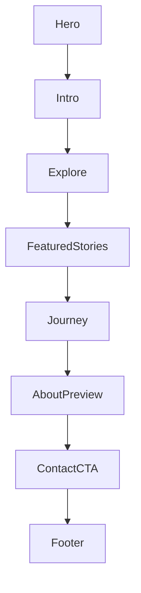
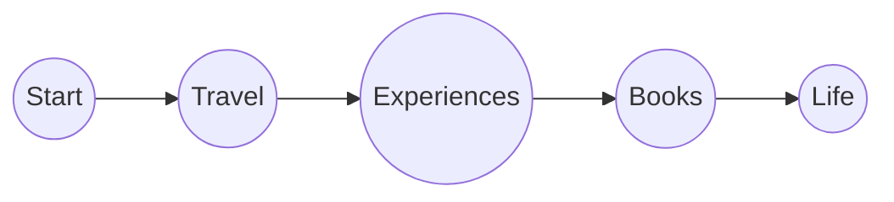
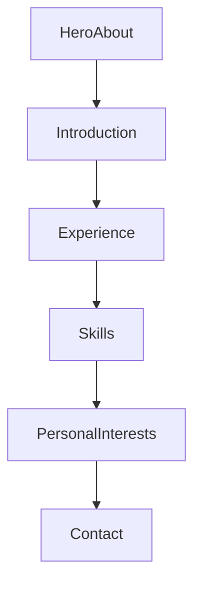
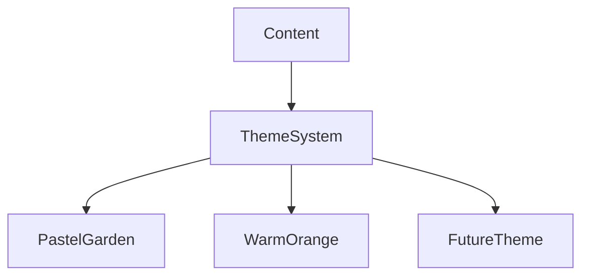
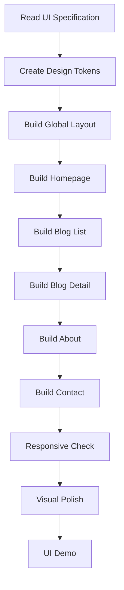

# UI Demo Specification — Vy Personal Blog

## 1. Product Vision

### Main Idea

Website không nên tạo cảm giác như một portfolio doanh nghiệp hoặc một blog công nghệ.

> Khi bước vào website, người đọc có cảm giác như đang bước vào một khu vườn mát mẻ, trong lành — một nơi có thể chậm lại, đọc một câu chuyện, khám phá một trải nghiệm và chia sẻ cảm xúc.

Website cần tạo cảm giác:

- Fresh
- Natural
- Warm
- Friendly
- Energetic nhưng bình ổn
- Personal
- Relaxing
- Có cảm giác được chào đón

Không nên:

- Quá corporate
- Quá luxury
- Quá futuristic
- Quá nhiều animation
- Quá nhiều gradient
- Quá nhiều card
- Quá nhiều hiệu ứng
- Quá high-energy

---

# 2. Design Direction

## Primary Direction: "A Calm Green Garden"

Visual language:

```text
Sky
  ↓
Light blue / white

Garden
  ↓
Soft green

Sunlight
  ↓
Soft yellow

Human warmth
  ↓
Warm orange / peach accent
```

Palette định hướng:

| Role | Direction | Gợi ý |
|---|---|---|
| Background | Warm white | #FAFBF7 |
| Primary Green | Soft leaf green | #8FBF9F |
| Deep Green | Forest green | #477A5B |
| Sky Blue | Soft sky blue | #B9DDF2 |
| Soft Yellow | Sunlight yellow | #F4D98B |
| Warm Orange | Peach / soft orange | #E9A36A |
| Text | Dark green-gray | #34443A |
| Muted Text | Gray-green | #7B877F |

**Lưu ý:** Đây là màu định hướng cho Demo, có thể tinh chỉnh sau khi render thực tế.

---

# 3. Alternative Color Direction

Có thể sử dụng hướng thứ hai:

## "Warm White + Orange"

Lấy cảm hứng từ mẫu travel có nền trắng kem và orange accent.

```text
Warm White
+
Soft Orange
+
Muted Green
+
Light Blue
```

Tuy nhiên:

> **Green + Yellow + Sky Blue + White là hướng ưu tiên số 1.**

Orange chỉ nên dùng làm accent nhỏ.

---

# 4. Overall Visual Personality

Website nên gợi liên tưởng tới:

```text
🌿 Garden
☀️ Morning sunlight
☁️ Blue sky
📖 Personal journal
✈️ Travel memories
🌼 Small moments
```

Không giống:

```text
❌ Corporate website
❌ SaaS landing page
❌ News website
❌ E-commerce
❌ Heavy portfolio
```

---

# 5. Design Principles

## Principle 01 — Content First

Blog không cần quá cầu kỳ.

```text
Simple UI
+
Beautiful typography
+
Good photography
+
Strong content
```

thay vì:

```text
Complex animation
+
Many visual effects
+
Complex interactions
```

## Principle 02 — Moderate Complexity

Chọn mẫu vừa phải, đơn giản hơn để tiết kiệm công sức và tập trung vào content.

Demo UI phải chứng minh:

- Layout đẹp nhưng không phức tạp
- Component có thể tái sử dụng
- Theme có thể mở rộng
- Không tạo animation chỉ để cho đẹp
- Không tạo section không có giá trị nội dung

## Principle 03 — Calm Energy

Website cần:

```text
Energy
+
Calm
```

Không phải:

```text
Energy
+
Excitement
+
Fast animation
```

Animation nên:

- Slow
- Soft
- Natural
- Subtle

Cho phép:

- Fade in nhẹ
- Image scale rất nhẹ khi hover
- Soft floating effect
- Smooth page transition

Không dùng:

- Flashing
- Aggressive parallax
- Large spinning elements
- Excessive scroll animation

---

# 6. Navigation

Navigation lấy cảm hứng từ mẫu "Be your authentic self".

Menu đơn giản:

```text
[Logo / Vy's World]

Home
About
Travel
Experiences
Marketing
Books
Contact
```

Có thể thêm:

```text
Language
☰
```

trên mobile.

---

# 7. Logo

Logo không cần phức tạp.

Có thể dùng:

```text
Vy
Vy's World
```

hoặc một symbol nhỏ liên quan tới:

- Leaf
- Flower
- Sun
- Garden
- Handwritten mark

Phong cách:

- Handwritten / editorial
- Personal
- Simple

Không dùng logo kiểu corporate.

---

# 8. Homepage

## Goal

Homepage phải trả lời trong vài giây:

1. Đây là website của ai?
2. Người này chia sẻ điều gì?
3. Website có cảm giác gì?
4. Tôi có muốn tiếp tục khám phá không?

## Structure



---

# 9. Hero Section

Lấy cảm hứng từ hình ảnh đầu tiên:

- Bầu trời
- Mây
- Đồng cỏ
- Ánh sáng
- Thiên nhiên
- Một quote ngắn

Hero không cần nhiều text.

Ví dụ:

```text
Be your
authentic self.

be kind and have courage
```

Hoặc một câu tagline tương tự.

## Hero Layout

```text
┌─────────────────────────────────────────┐
│ Logo          Home About Travel ...     │
│                                         │
│        Be your authentic self           │
│                                         │
│       [soft landscape image]            │
│                                         │
│                 ↓                       │
└─────────────────────────────────────────┘
```

Hero image có thể là:

- Illustration
- Watercolor landscape
- Soft photograph
- AI-generated artwork

Ưu tiên:

- Sky
- Green
- White
- Yellow sunlight

---

# 10. Garden Entry Section

Ngay dưới Hero tạo cảm giác người đọc đang bước vào khu vườn.

Ví dụ:

```text
Welcome to my little garden.

A place for stories,
experiences,
ideas
and little things worth remembering.
```

Visual:

- White background
- Small leaves
- Soft blue / green illustration
- Lots of whitespace

---

# 11. Explore Section

Lấy cảm hứng từ concept "GET ON BOARD", nhưng không copy trực tiếp.

Có thể dùng:

```text
COME EXPLORE

Travel
Experiences
Books
Marketing
Life
```

Các category có thể nằm trên một đường route nhẹ.



Đường nối có thể giống:

- hand-drawn line
- garden path
- travel route

Không cần bản đồ thật.

---

# 12. Featured Stories

Đây là section quan trọng.

Mục tiêu:

> Đưa content lên trước.

Layout:

```text
Latest stories

┌─────────────┐  ┌─────────────┐
│    Image    │  │    Image    │
├─────────────┤  ├─────────────┤
│ Category    │  │ Category    │
│ Title       │  │ Title       │
│ Summary     │  │ Summary     │
└─────────────┘  └─────────────┘
```

Desktop: 2 hoặc 3 cards.

Mobile: 1 card / row.

---

# 13. Blog Card

Thông tin:

```text
Image
Category
Title
Short excerpt
Date
```

Không cần:

- quá nhiều badge
- nhiều button
- rating
- metadata dư thừa

CTA:

```text
Read story →
```

---

# 14. Journey / Route Section

Có thể tạo điểm nhấn riêng cho website.

Lấy cảm hứng từ "Wanderlust Route".

Không cần bản đồ phức tạp.

```text
My journey

     ● Travel
      \
       \
        ● Experiences
         \
          \
           ● Books
            \
             ● Marketing
```

Mỗi điểm có:

- icon
- title
- short description

Click vào sẽ dẫn đến category.

---

# 15. About Preview

Homepage chỉ cần giới thiệu ngắn.

Ví dụ:

```text
A little about me

I'm Vy.
I collect stories from places,
people and everyday moments.

[Discover more →]
```

Có thể có:

- Portrait
- Small handwritten illustration
- Plant / leaf decoration

---

# 16. Contact / Closing Section

Không nên quá corporate.

```text
Let's stay connected.

Have a story to share?
Want to say hello?

[Contact me →]
```

Visual:

- Sky blue
- Soft green
- Small clouds / leaves

---

# 17. Footer

Simple:

```text
Vy

Home
About
Travel
Experiences
Marketing
Books
Contact

© 2026 Vy
```

Có thể thêm:

- Social links
- Email
- Language selector

---

# 18. Blog List Page

## Goal

Người đọc dễ dàng tìm bài viết.

```text
BLOG

Stories, experiences
and little things worth remembering.

[ Search ]

Categories

┌────────────┐
│   Image    │
├────────────┤
│ Category   │
│ Title      │
│ Excerpt    │
└────────────┘
```

Categories:

```text
All
Travel
Experiences
Marketing
Books
Life
```

Có thể dùng text tabs, pill hoặc underline.

Không nên quá nhiều màu.

---

# 19. Blog Detail Page

## Priority

**Reading experience > Decoration**

```text
┌─────────────────────────────────┐
│ Category                        │
│                                 │
│ Blog title                      │
│                                 │
│ Date                            │
│                                 │
│        Cover Image              │
│                                 │
├─────────────────────────────────┤
│                                 │
│ Article Content                 │
│                                 │
│ Article Content                 │
│                                 │
│ Article Content                 │
│                                 │
└─────────────────────────────────┘
```

## Typography

- Editorial
- Soft serif hoặc elegant sans-serif
- Highly readable
- Line-height rộng
- Không quá nhỏ

Đề xuất:

```text
Body desktop: 18px
Line height: 1.7 ~ 1.9
Content width: 680 ~ 760px

Mobile: 16 ~ 18px
```

## Blog Image

- Rounded corners nhẹ
- Natural aspect ratio
- Soft shadow rất nhẹ hoặc không shadow
- Không crop quá mạnh

Có thể có caption:

```text
A quiet morning in Kyoto.
```

---

# 20. About Me Page

## Concept

> **Portfolio nhẹ nhàng, đơn giản.**

Không biến thành corporate CV.

## Structure



## About Hero

```text
Hello, I'm Vy.

[Portrait]

A short sentence
about who I am.
```

Visual:

- White
- Green
- Small botanical decoration

## Experience

Có thể trình bày:

```text
Experience

Marketing
Company / Organization
Description

...

Travel / Project
Description
```

Layout vẫn nên mềm mại.

## Skills

Không dùng progress bars kiểu "90%".

Thay vào đó:

```text
Marketing
Content
Communication
Travel
Project Management
```

dạng typography / chips nhẹ.

---

# 21. Contact Page

Simple:

```text
Let's talk.

Email
Social

[Contact Form]
```

Form:

```text
Name
Email
Message

[Send message]
```

---

# 22. Responsive Design

## Desktop

Ưu tiên:

- whitespace
- large visual
- editorial layout

Breakpoint:

```text
Desktop ≥ 1024px
```

## Tablet

```text
768px ~ 1023px
```

## Mobile

```text
< 768px
```

Mobile phải được thiết kế riêng, không chỉ shrink desktop.

## Mobile Navigation

Desktop:

```text
Logo | Home About Travel Experiences Books Contact
```

Mobile:

```text
Logo                         ☰
```

Menu:

```text
Home
About
Travel
Experiences
Marketing
Books
Contact
```

---

# 23. Animation Rules

Animation phải phục vụ cảm giác "calm".

Cho phép:

```text
fade
slide-up
soft-scale
hover
```

Duration:

```text
200ms ~ 600ms
```

Không lạm dụng.

---

# 24. Image Direction

Hình ảnh là một phần quan trọng của visual identity.

## Nature

- Sky
- Grass
- Flowers
- Trees
- Clouds
- Morning sunlight

## Travel

- Streets
- Buildings
- Landscapes
- Food
- Small details

## Personal

- Portrait
- Desk
- Books
- Coffee
- Daily life

Style:

```text
Natural
Warm
Soft
Bright
Airy
```

---

# 25. Illustration Direction

Nếu dùng illustration:

- Watercolor
- Hand-drawn
- Soft digital painting
- Editorial illustration

Tránh:

- 3D corporate illustration
- Neon
- Cyberpunk
- Generic SaaS illustration

---

# 26. Theme Architecture

Mặc dù Demo chỉ cần một theme, code phải được tổ chức để sau này có thể thay đổi theme.



Content không được hard-code màu sắc vào từng component.

---

# 27. Recommended Component Structure

```text
components/

layout/
  AppHeader.vue
  AppFooter.vue
  MobileMenu.vue

home/
  HeroSection.vue
  GardenIntro.vue
  ExploreSection.vue
  FeaturedStories.vue
  JourneySection.vue
  AboutPreview.vue
  ContactCTA.vue

blog/
  BlogCard.vue
  BlogGrid.vue
  BlogCategoryNav.vue
  BlogHero.vue

about/
  AboutHero.vue
  ExperienceSection.vue
  SkillsSection.vue

contact/
  ContactForm.vue

ui/
  BaseButton.vue
  BaseContainer.vue
  SectionHeading.vue
```

---

# 28. Technical Direction for Demo

Framework:

```text
Nuxt 4
TypeScript
```

Styling:

```text
Tailwind CSS
```

Không thêm UI library lớn nếu không cần thiết.

---

# 29. Demo Scope

Claude Code **chỉ làm Demo UI** trước.

## Must Have

- Homepage
- Blog List
- Blog Detail
- About
- Contact
- Header
- Footer
- Responsive
- Theme tokens
- Sample content
- Sample images / placeholders

## Không làm trong UI Demo

- Supabase
- Authentication
- Admin
- Tiptap
- Database
- CMS
- Image upload
- Search backend
- API

---

# 30. Demo Content

Không chờ nội dung thật. Có thể dùng sample content để test layout.

Ví dụ:

### Travel

```text
A quiet morning in Kyoto
```

### Experiences

```text
What I learned from starting over
```

### Books

```text
Books that stayed with me
```

### Marketing

```text
Small things I've learned about people and stories
```

---

# 31. Demo Acceptance Criteria

## Visual

- [ ] Website có cảm giác fresh
- [ ] Có màu xanh lá chủ đạo
- [ ] Có sky blue / white
- [ ] Có yellow accent nhẹ
- [ ] Có thể thêm orange accent
- [ ] Không quá nhiều màu
- [ ] Không quá nhiều card
- [ ] Không quá nhiều animation

## Homepage

- [ ] Hero đẹp
- [ ] Navigation rõ
- [ ] Introduction
- [ ] Explore section
- [ ] Featured stories
- [ ] Journey section
- [ ] About preview
- [ ] Contact CTA
- [ ] Footer

## Blog

- [ ] Blog List dễ đọc
- [ ] Blog Detail tập trung vào content
- [ ] Typography đẹp
- [ ] Image presentation đẹp

## About

- [ ] Có cảm giác portfolio
- [ ] Đơn giản
- [ ] Có thể dùng để giới thiệu công việc

## Responsive

- [ ] Desktop
- [ ] Tablet
- [ ] Mobile

---

# 32. Important Instruction for Claude Code

> **Đừng cố biến website thành một sản phẩm UI phức tạp.**

Mục tiêu:

```text
Simple
+
Beautiful
+
Personal
+
Content-focused
```

Nếu phải lựa chọn giữa:

```text
Complex visual effect
```

và:

```text
Better readability
```

hãy chọn:

```text
Better readability
```

---

# 33. Development Process



---

# 34. Claude Code Working Rules

Before coding:

```text
Read this file completely.

Do not implement backend.
Do not implement CMS.
Do not implement Supabase.
Do not implement Tiptap.

Focus only on UI Demo.
```

After each major page:

```text
Run the app.
Check desktop.
Check mobile.
Fix layout issues.

Do not move to the next page until
the current page is visually acceptable.
```

---

# 35. Recommended First Prompt

```text
Read:

docs/ui-wireframe.md

This document contains the UI/UX direction for Vy's personal blog.

Your task is to build the UI Demo only.

Technology:
- Nuxt 4
- TypeScript
- Tailwind CSS

Important:
- Do NOT implement Supabase.
- Do NOT implement authentication.
- Do NOT implement Admin CMS.
- Do NOT implement Tiptap.
- Do NOT implement backend APIs.
- Do NOT add unnecessary dependencies.

Design direction:
- Calm green garden
- Soft green
- Sky blue
- Warm white
- Light yellow
- Optional soft orange accent
- Personal
- Fresh
- Calm energy
- Content-first
- Simple but beautiful

Pages:
1. Home
2. Blog List
3. Blog Detail
4. About
5. Contact

Build reusable components.

Create design tokens so the theme can be changed later.

Use realistic sample content and image placeholders.

Prioritize:
1. Visual hierarchy
2. Typography
3. Spacing
4. Responsive behavior
5. Content readability

Do not over-engineer the design.

First inspect the existing project and create an implementation plan.

Do not start coding until the plan is clear.
```

---

# 36. Final Design Statement

> **A little green garden on the internet where people can slow down, read, explore and share stories.**

The visual balance should be:

```text
        ENERGY
           ▲
           │
           │
CALM ◄─────┼─────► PERSONAL
           │
           │
           ▼
        NATURAL
```

The final website should feel:

**Fresh but not noisy.**

**Beautiful but not complicated.**

**Personal but still professional.**

**Calm but not boring.**

**Simple enough to maintain, strong enough to become Vy's personal identity online.**
